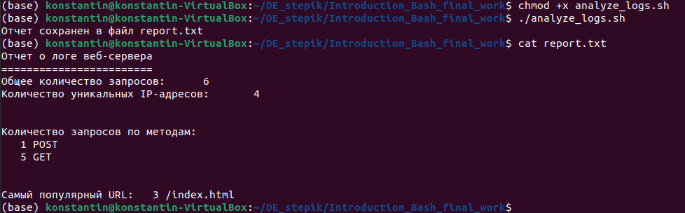

# ТЗ
Написать Bash-скрипт анализирующий файл с логами

* Подсчитать общее количество запросов.
* Подсчитать количество уникальных IP-адресов. Строго с использованием **awk**.
* Подсчитать количество запросов по методам (GET, POST и т.д.). Строго с использованием **awk**.
* Найти самый популярный URL. Строго с использованием **awk**.
* Создать отчет в виде текстового файла. Название текстового файла - **report.txt**
# Реализация
Написан Bash-скрипт [analyze_logs.sh](analyze_logs.sh)

Команда для генерации логов
```
cat <<EOL > access.log
192.168.1.1 - - [28/Jul/2024:12:34:56 +0000] "GET /index.html HTTP/1.1" 200 1234
192.168.1.2 - - [28/Jul/2024:12:35:56 +0000] "POST /login HTTP/1.1" 200 567
192.168.1.3 - - [28/Jul/2024:12:36:56 +0000] "GET /home HTTP/1.1" 404 890
192.168.1.1 - - [28/Jul/2024:12:37:56 +0000] "GET /index.html HTTP/1.1" 200 1234
192.168.1.4 - - [28/Jul/2024:12:38:56 +0000] "GET /about HTTP/1.1" 200 432
192.168.1.2 - - [28/Jul/2024:12:39:56 +0000] "GET /index.html HTTP/1.1" 200 1234
EOL
```
Сделать файл исполняемым

`chmod +x analyze_logs.sh`

Запуск

`./analyze_logs.sh`

# Результат


